# CompTIA A+ Notes
> Compiled By: Ethan Smith

## Trouble Shooting Methodology
1. Identify the problem
2. Establish a theory of probable cause (question the obvious)
3. Test the theory to determine the cause
4. Establish a plan of action to resolve the problem and implement a solution
5. Verify full system functionality (if applicable, implement preventative measures)
6. Document the findings, actions, and outcomes.+

## USB Cables

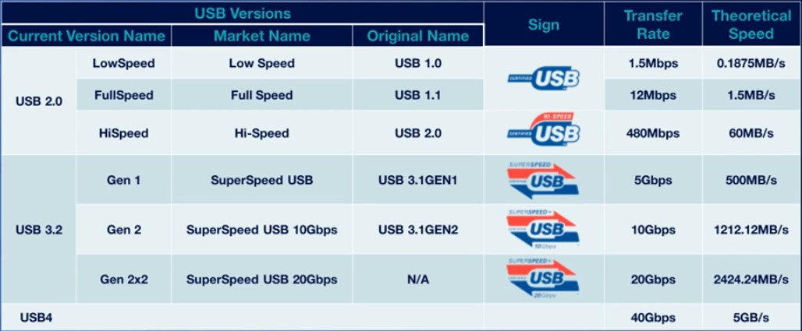

    
Click to show/hide image and table

    <table>
    <thead>
    <tr>
    <th align="center">Version Name</th>
    <th align="center">Market Name</th>
    <th align="center">Original Name</th>
    <th align="center">Transfer Rate</th>
    <th align="center">Theoretical Speed</th>
    </tr>
    </thead>
    <tbody><tr>
    <td align="center"></td>
    <td align="center"></td>
    <td align="center"></td>
    <td align="center"></td>
    <td align="center"></td>
    </tr>
    <tr>
    <td align="center"></td>
    <td align="center">LowSpeed</td>
    <td align="center">USB 1.0</td>
    <td align="center">1.5Mbps</td>
    <td align="center">0.875MB/s</td>
    </tr>
    <tr>
    <td align="center">USB 2.0</td>
    <td align="center">FullSpeed</td>
    <td align="center">USB 1.1</td>
    <td align="center">12Mbps</td>
    <td align="center">1.5MB/s</td>
    </tr>
    <tr>
    <td align="center"></td>
    <td align="center">HiSpeed</td>
    <td align="center">USB 2.0</td>
    <td align="center">480Mbps</td>
    <td align="center">60MB/s</td>
    </tr>
    <tr>
    <td align="center"></td>
    <td align="center"></td>
    <td align="center"></td>
    <td align="center"></td>
    <td align="center"></td>
    </tr>
    <tr>
    <td align="center"></td>
    <td align="center">(Gen 2) SuperSpeed USB</td>
    <td align="center">USB 3.1GEN1</td>
    <td align="center">5Gbps</td>
    <td align="center">500MB/s</td>
    </tr>
    <tr>
    <td align="center">USB 3.2</td>
    <td align="center">(Gen 2) SuperSpeed USB 10Gbps</td>
    <td align="center">USB 3.1GEN2</td>
    <td align="center">10Gbps</td>
    <td align="center">1212.12MB/s</td>
    </tr>
    <tr>
    <td align="center"></td>
    <td align="center">(Gen 2x2) SuperSpeed USB 20Gbps</td>
    <td align="center">N/A</td>
    <td align="center">20Gbps</td>
    <td align="center">2424.24MB/s</td>
    </tr>
    <tr>
    <td align="center"></td>
    <td align="center"></td>
    <td align="center"></td>
    <td align="center"></td>
    <td align="center"></td>
    </tr>
    <tr>
    <td align="center">USB 4.0</td>
    <td align="center"></td>
    <td align="center"></td>
    <td align="center">40Gbps</td>
    <td align="center">5MB/s</td>
    </tr>
    </tbody></table>

 

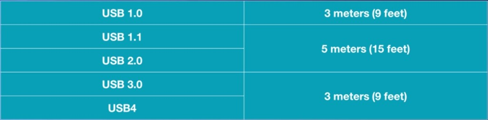

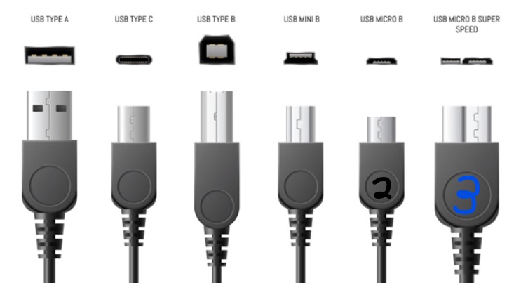

## Video Cables

### HDMI (High Definition Multimedia Interface)

1. HDMI Digital Content Protection (HDCP): Allows a device to validate the connection
2. Type A: Regular full-size connector
3. Type C: Mini connector
4. Type D: Micro connector

 - **Category 1 (Standard)** -> Used for video content (1080P/60Hertz)
 - **Category 2 (High Speed)** -> Has great length of distance and high resolution (18Gbps-48Gbps)

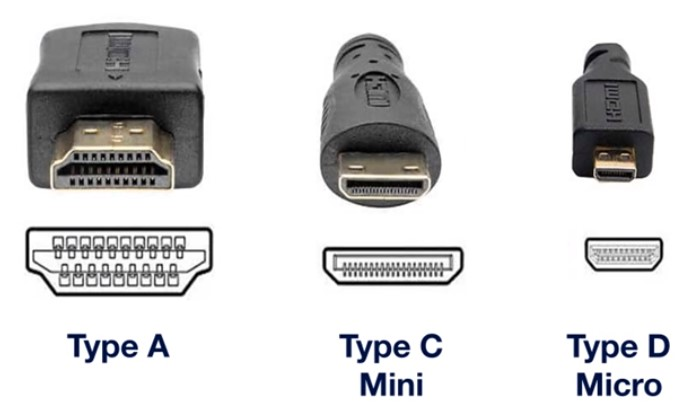

### DP (DisplayPort)

1. **Full Size DisplayPort** -> DP
2. **Mini DisplayPort** -> MDP
3. Up to 20Gbps

### DVI (Digital Video Interface)

1. Supports analog and digital outputs
2. DVI-A: Supports analog signals
3. DVI-D: Supports digital signals 
4. DVI-I: Supports analog or digital signals

### VGA (Video Graphics Adapter)

1. Uses a 15-pin standard analog video interface port

### Thunderbolt

1. Acts like a display interface and can do data transfer
2. **Thunderbolt 1 and 2**: Use a physical connector that's backwards compatible with DP
3. **Thunderbolt 3**: Changed the physical interface to use the same port connector as USB-C

- USB-C **does not always** suport Thunderbolt 3, but all Thunderbolt 3 support USB-C
- The maximum cable length for Thunderbolt 3 is **1.6ft**, which provides up to 40Gbps

## Storage Cables

### Thunderbolt

- **Version 1 and 2** -> Uses DP-type connector
- **Version 3 and 4** -> Uses USB-C type connector
- Version 4 will operate on a USB-C port.
- 40Gbps, 2 feet

### Lightning Cable
Specific *proprietary* connector created by Apple for mobile devices

### SATA (Serial Advanced Technology Attachment)
Standard method of connecting a storage decive to a motherboard

- **SATA 7-Pin Data Cable** -> Does not supply power
- **SATA 5-Pin Power Cable** -> Provides the power

1. Version 1 -> Supports speeds of up to 1500Mbps (1.5Gbps)
2. Version 2 -> Supports speeds of up to 3000Mbps (3Gbps)
3. Version 3 -> Supports speeds of up to 6000Mbps (6Gbps)

The ***limitation*** will be the hard drive and not the data cable

### eSATA (External SATA)
Cable outside of the case

- eSATA2 at 3Gbps
- eSATA3 at 6Gbps

Not common anymore

### IDE (Integrated Drive Electronics) Interace
> Renamed
### PATA (Parallel Advanced Technology Attachment)
Uses IDE cables and connectors and standards but is differentiated from SATA

- Doesn't provide power
- *Pin ribbon cable* (Parallel) -> Supports up to two devices and can communicate at the same time 
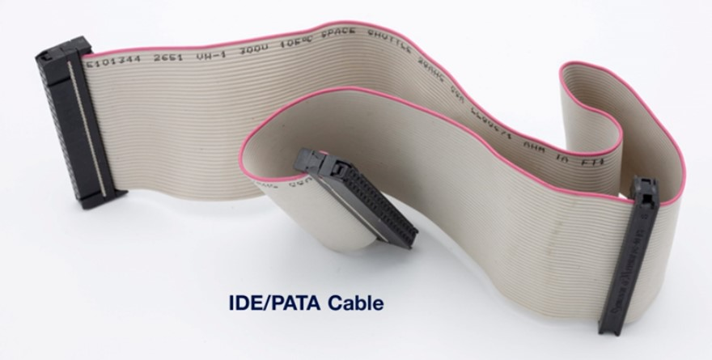

- **MOLEX Power Connector** -> A 4-pin connector attached directly from the power supply to a device
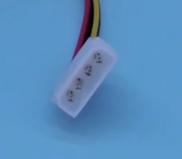

### SCSI (Small Computer Systems Interface)
Legacy parallel bus connector that allows multiple devices to be daisy chained together (it's slow)

- **Narrow SCSI** -> supports up to 7 devices
- **Wide SCSI** -> supports up to 15 devices

- **High Density Cable - 68 pins** -> Sends data but no power and would need a MOLEX power connector
- **SCA (Single Connector Attachment) - 80 pins** -> Provides power and transfers data

## Motherboards

- **Input** -> Process of accepting data in a form that the computer can use
- **Output** -> Process of displaying the processed data or information
- **Processing** -> Actions performed by the CPU when receiving information. Conducted by the CPU or GPU
- **Storage** -> Process of saving or retaining digital data, temporarily or permanently

- **Temporary/Volatile storage is Non-persistent (RAM)** -> Speed is *fast* (measured in GHz)
- **Permanent/Non-volatile storage is Persistent (Hard Drives)** -> Speed decreases rapidly (measured in MHz)

- Data transferred across the motherboard measures the speed of data in MHz or GHz

### Form Factors
Shape, layout, and type of case and power supply that will be used by the system

- **ATX (Advances Technology eXtended)** -> Full-size motherboard and measure 12" x 9.6" in size (305mm x 244mm)
- **mini-ATX** -> Smaller than ATX but contains the same features (11.2" x 8.2" / 284mm x 208mm)
- **mATX (micro-ATX)** -> Measures 9.6 inches squared (244mm x 244mm)
- **ITX (Information Technology eXtended)** -> Designed as replacement for the ATX but ***never produced***
- **Mini-ITX** -> Measures 6.7" x 6.7" with only one expansion slot (170mm x 170mm)

### CPU (Central Processing Unit) Architecture

- **X86 (IA-32 / Intel Architecture-32)** -> Developed by Intel with an 8-bit, 16-bit, and up to 32-bit instruction set
  - Can only support a maximum of 4GB of RAM
  - Can only run 32-bit programs
- **X64** -> Supports 64-bit instruction set
  - Can support up to 2.3EB of RAM (1,300,000TB)
  - Can run 64-bit and 32-bit programs
- **ARM (Advanced RISC Machine)** -> Used for low-power devices (tablets and cell phones)
  - **RISC** -> Reduced Instruction Set Computing
  - Extended battery life
  - Produces less heat
  - **RISC** systems use code to do tasks

### CPU Sockets

- **ZIF (Zero Insertion Force)** -> Inserts the CPU without pressing down and giving no pressure
- **LGA (Land Grid Array)** - (Intel) Form factor that positions all pins to connect the CPU processor into the socket
- **PGA (Pin Grid Array)** - (AMD) Form factor where the processor has the pins and the socket has the holes

A *single socket* architecture on desktop motherboards can only support on physical processor
A *multi-socket* can have multiple CPUs or processors installed on the motherboard (usually for servers/high-end workstations)

- **Intel Desktop Socket** -> LGA 2011. LGA 1151, LGA 2066
- **AMD Desktop Socket** -> AM2, AM3, AM4

### CPU Features

- **SMT (Simultaneous MultiThreading; generic term)/Hyper-Threading (Intel)** -> Single stream of instructions is being sent by a software application to a processor
- **SMP (Symmetric Multiprocessing)** -> Traditional workstation and servers have multiple processors
- **Multi-core Processors** -> Single CPU with muliple processors inside
  - Dual-core -> two CPUs inside a single chip
  - Quad-core -> Four CPUs inside a single chip
  - Hexa-core -> Six CPUs inside a single chip
  - Octa-core -> Eight CPUs inside a single chip
- **Virtualization** -> Pretend there are other computers inside itself
  - VT (Intel)
  - AMD-V (AMD)
  - Provide processor extensions to support virtualization 

> Understand that some computers have these capabilities providing better performance than those that do not.

### Motherboard Connectors
> 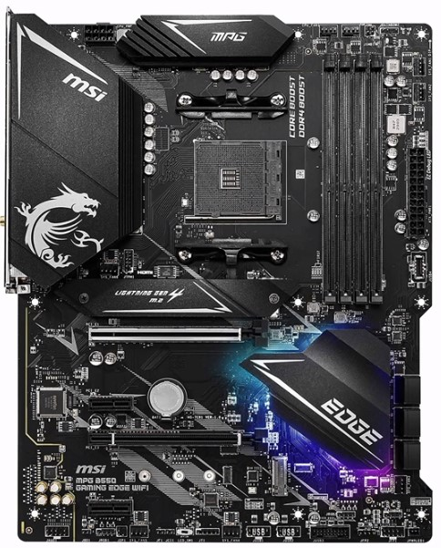

#### CPU Socket
> 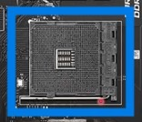

#### Memory Sockets
> 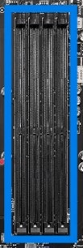

#### Main Power 
> 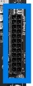

#### CPU Power
> 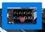

#### Case Fan Power
> 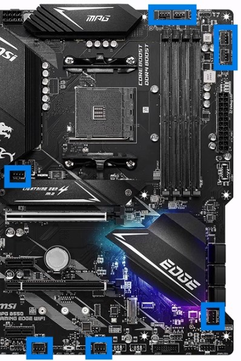

#### USB Header Port
> 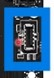
> 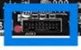

#### Power LED Connector
> 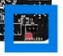

#### Audio Header Port
> 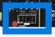

#### PCIe x1 (expansion slot)
> 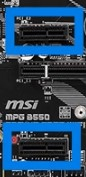

#### PCIe x16 (expansion slot)
> 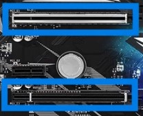

#### M.2 Connector
> 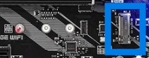
> 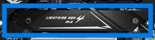

#### CMOS Batter
> 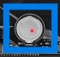

#### SATA Ports
> 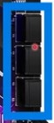
> 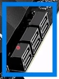

#### Rear Port Cluster
> 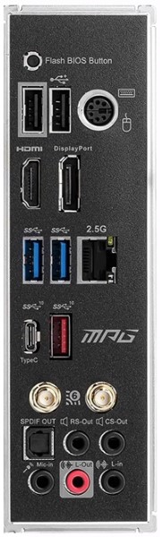
> 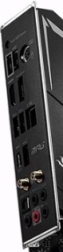

#### USB 2.0
> 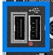

#### PS2 Keyboard/Mouse Port
> 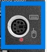

#### HDMI and DP
> 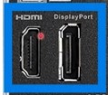

#### SuperSpeed USB 3 / USB 3 10Gbps 
> 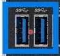
> 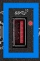

#### RJ45 Network Jack (2.5Gbps)
> 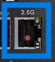

#### SuperSpeed USB 3 Type C (10Gbps)
> 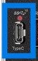

#### WiFi 6 Antenni Connectors
> 

#### Audio Cluster
> 

### Installing a Motherboard

1. Review the motherboard's documentation 
2. Position the motherboard to align with the rear of the case
3. Insert the standoffs to match the hole locations on the motherboard
4. Install the processor and memory modules before installing the motherboard
5. Verify the standoffs are properly aligned prior to installing the motherboard
6. Secure the standoffs with the appropriate screw type
7. install the power supply, disk drives, add-on cards, and other components

### Expansion Cards

- Mostly used for Network and Audio cards because they were slow
  - **PCI** -> 32-bit cards. Only supports maximum bus speed of 33MHz or 133MBps
  - **PCI-X** -> 64-bit expansion card (133MHz)
  - **PCI-X 2.0** -> 266MHz up to 533MHz
- **AGP (Accelerated Graphics Port)** -> Used for video graphics cards
  - AGP 1x, 2x, 4x, 8x 
- **PCIe (Peripheral Component Interconnect Express)** -> replaces PCI, PCI-X, and AGP
  - **PCIe x1** -> Used for modems, network cards, wireless cards, input/output devices, and audio cards
  - **PCIe x4 and PCIe x8**
  - **PCIe x16** -> Used for graphics cards
  - PCIe x1 will be slower than PCIe x16.
  - All PCIe slots provide **25 watts of power**
  - PCIe x16 card slot provides up to **75 watts of power**
  - **Up-Plugging** -> Putting smaller card in a larger slot
  - **Down-Plugging** -> Putting larger card in a smaller slot (card has to support Down-Plugging or it won't fit)
  - **Mini PCIe** -> Smaller form fact used inside of laptops, specifically for wireless networking

Motherboard has limited lanes; x1, x4, x8, x16 are the lanes the PCIe uses
If the motherboard has 24 lanes and you are using 2 PCIe x16 GPUs, the 32 lanes of information have to slow down to go through the 24 available lanes the motherboard has.

> **Remember**
> In modern computers, the expansion slots you'd see are PCIe x1 and x16.

### Types of Expansion Cards

- **Video Card/Graphic Adapte**r -> Gives quality signals to monitors
  - **GPU (Graphics Processing Unit)** -> Specialized processor designed to accelerate graphics rendering
  - **High Speed Memory** -> Embeds the memory to give addition capability to offload from the system
  - **Graphical Ports** -> Installed outside of the card (Thunderbolt, DisplayPort, and HDMI)
- **Video Capture Card** -> Takes video signals and processes them inside the computer
- **TV Capture Card** -> Cables are plugged into a computer to get all cable TV channels
- **Sound/Audio Card** -> Gives better output through audio
- **NIC (Network Interface Card)**
  - RJ45
  - **ST / SC / MT-RJ connector** -> Supports fiber card
  - WiFi capability
- **Riser Card** -> Special type of expansion card on a motherboard
  - A smaller pc may not fit a full graphics card so a Riser card moves the PCIe slots to be parallel to the motherboard
    

## Cooling and Power

### Cooling System

- **Passive Cooling** -> Type of cooling that doesn't rely on moving parts or power
  - **Heatsink** -> Finned metal device that radiates heat away from the processor
  - **Thermal Paste** -> Compound that ensures heat transfer by eliminating air gaps
- **Active Cooling** -> Uses a fan to cool down the heat from the device
  1. Top of the processor
  2. Case fans
  3. Back of the power supply
  4. External graphics cards

### Liquid Cooling

- In High performance systems
- **Closed loop system** -> cooling of a single component
- **Open loop system** -> Liquid cooling based system of different components
- **Water** and **liquids** are more effective coolants than air convection

### PSU (Power Supply Unit)

- AC (Alternating Current) is cycled between positives and negatives repeatedly
- **Modular PSU / Modular Power Supply Unit** -> Allows to unhook the connectors and detatch from the unit

#### Power Supply Connectors

- **Main Board / Motherboard Adapter** -> Provides power to the motherboard
  - **ATX Standard** -> 20-pin connector
  - **ATX 12V** -> 24-pin connector (almost all)
  - **20+4 Pin** -> Two connectors are coupled together before pluggin into a 4-pin connector
- **Processor Power/CPU Power** -> Has a four, six, or eight-pin connector
- PCIe Adapter Card
- **SATA Power Connector** -> Used to power the SATA Drive
- **Molex Connector** -> Used for IDE and PATA hard disks, CDs, and DVD drives
- **Y Connector** -> One connector that can support multiple devices

#### Input Voltages
- **120V AC (Low Line Power)** -> US-based power supply
- **230V AC (High Line Power)** -> Europe and Asia power supply

#### Most power supplies will support mult-voltage outputs
- **Voltage Sensing/ Dual Voltage Power Supplies** -> Detects the outlet and converts it into the voltage of DC

#### Output Voltages
- +3.3VDC
- +5VDC
- +12VDC
- -12VDC
- **Rail** -> Wire that provides current at a particular voltage
- **12 VDC Rail** -> Cable or wire that provides 12 VDC
- 12 VDC is the most commonly used voltage in the PC

#### Wattage Rating -> Power supply's output capacity or capability

- Watts = Voltage*Current(Amps)

## System Memory

- Cache -> High-speed memory
- RAM (Random Access Memory) / System Memory -> Temporary storage area/ non-persistent storage
- Storage -> Mass storage device that holds more data but is slower than a cache. Permanent storage area/ persistent storage
- Disk Cache -> Pulls the files from the disc into memory and replaces the old file

### Addressing Memory -> Processor reaching the files inside RAM
    - **32-bit (x86)** -> 4 billion address location (4GB of data)
    - **64-bit (x64)** -> 184 quintillion address locations (16EB of data)

### Memory Modules
- Single Bank -> Can put any size module in any slot
- Paired Bank -> Requires installation of banks in pairs
- DIMM (Dual Inline Memory Modules)
- DDR3, 4, 5 (Dual Data Rate)
- RDRAM (Rambus Dynamic Random Access Memory)
- Throughput -> Calculated based on the bus speed and the width of the databus

#### In historical order

- **DRAM (Dynamic RAM)** -> Oldest Type of memory that requires frequent refresh
  - DRAM storage cell is dynamic
- **SRAM (Static RAM)** -> Solved the issue of the constant refresh, but was expensive
- **SDRAM (Synchronous DRAM)** -> First memory module that operates at the same speed as the motherboard bus
  - PC66 (66 MHz bus)
  - PC133 (133 MHz bus)
  - PC266 (266 MHz bus)
- **DDR SDRAM (Double Data Rate Synchronous Dynamic RAM)** -> Doubles the transfer speed of an SRAM module (184-pin connector)
- **DDR2 SDRAM (Double Data Rate 2 Synchronous Dynamic RAM)** -> Higher latency and has faster access to the external bus (240-pin connector)
  - **PC2-4200** -> 4200MB/s Throughput
- **DDR3 SDRAM (Double Data Rate 3 Synchronous Dynamic RAM)** -> Runs at a lower voltage and at a higher speed than DDR2 (240 keyed pin connector)
  - **PC3-10600** -> 10600 MB/s Throughput
  - 6.4 - 17 GB/s with a maximum module size of 8GB per memory module
- **DDR4 (Double Data Rate 4)** -> 12.8 to 25.6 GB/s of throughput; 32 GB per module
- **DDR5 (Double Data Rate 5)** -> 38.4 to 51.2 GB/s of throughput; 128 GB per module

> Do not need to know the limits of speed for each modules type/version. You should, however, know that PC4-16000 signifies that is has that 16000 MB/s or 16GB/s of throughput being specified. Note the keyings are different

- **A mix and match of middules is possible with the same type and different speeds** -> the faster module will slow itself to match speeds

- SODIMM (Small outline Dual In-line Memory Module) -> Still classified as DDR4, DDR4, or DDR5
  - SODIMM PC4-16000 (16GB/s)
  - Smaller form factor for laptops

### Multi-Channel Memory -> Uses two different memory module to increas the performance and throughput
Just because a motherboard has 4 slots doesn't mean it supports Quad-Channel. 
 
- **Single-Channel** -> Uses one memory module on one bus (64-bit data bus)
- **Dual-Channel** -> Requires two memory modules and two memory slots on the motherboard (128-bit data bus)
- **Triple-Channel** -> Uses three memory modules and three memory slots (192-bit data bus)
- **Quad-Channel** -> Uses four memory modules and four memory slots on the motherboard (256-bit data bus)
- In **multi-channel** configurations, use the same model, speed, and throughput of memory so no module has to slow down for another.

### ECC (Error Correction Code) Memory

- Non-Parity Memory -> Standard memory that does not check for errors and allows data to be put in or taken out
- Parity Memory -> Performs basic error checking and ensures the memory contents are reliable
- ECC (Error Correction Code) -> Detects and corrects an error
- Buffered/Registered Memory -> Additional hardware (register) between memoru and CPU

> Motherboard and Memory module have to support ECC to utilize it

- DDR5 has internal error checking for its modules but is not considered Error Correcting Code
- DDR5 can still have ECC or non-ECC capabilities but this is separate from the internal Error checking

### Virtual Memory/Page File -> Space on a hard drive that is allocated by the OS and pretends to be memory

- Page file (Windows) and Swap Space (Linux Unix/ Mac)
  - A page file or swap space is hidden on a storage device and pretends to be system memory
  - Chunks are 4KB-sized
  - *slow*

                     
                     
### Ports and Standards
| Port   | Name | Service Description |
|-|-|-|
| 20, 21 | File Tansfer Protocol (FTP) | Transfers files |
| 22 | Secure Shell (SSH) | Secure remote control of another machine using a text based environment |
| 22 | Secure FTP (SFTP)  | Tunneling FTP through SSH for Secure File Transfers |
| 23 | Telnet | SSH but insecure... Don't use. |
| 25 | Simple Mail Transfer Protocol (SMTP) | Sending email over the internet |
| 53 | Domain Name System (DNS) | Resolving hostnames to IPs and IPs to hostnames |
| 67, 68 | Dynamic Host Configuration Protocol (DHCP)   | Auto-assigns IP addresses to devices on the network |
| 69 | Trivial FTP (TFTP) | Simple file transfer   |
| 80 | HyperText Transfer Protocol (HTTP)   | Unsecured web browsing |
| 110    | Post Office Protocol v3 (POP3)   | Receiving/Downloading email from a mail server  |
| 123    | Network Time Protocol (NTP)  | Sync the time for all devices on the network    |
| 137,139| NetBIOS    | Name querying, data sending, and more   |
| 143    | Internet Mail Application Protocol (IMAP)    | Receiving/Downloading email with more features than POP3  |
| 161    | Simple Network Management Protocol (SNMP)    | Remotely monitoring network devices |
| 389    | Lightweight Directory Access Protocol (LDAP) | Maintaining directories of users and objects    |
| 443    | HTTP Secure (HTTPS)    | Secure web browsing over TLS/SSL    |
| 445    | Server Message Block (SMB)   | Providing shared access to files and resources  |
| 636    | LDAP Secure (LDAPS)    | Secure maintenance of user directories  |
| 3389   | Remote Desktop Protocol (RDP) not secure | Remotely viewing and controlling Windows systems    |
| 5060,1 | Session Initiation Protocol (SIP)    | Real-time Audio (VOIP) |
| 65,535 | Last Available Port    | No ports follow 65,535 (aka, 65,536 and above do not exist)   |

Ports Continued in lesson, may be less likely to remember

| Port   | Name   | Service Description    |
|-|-|-|
| 465    | SMTP Secure    | Secure version of SMTP |
| 993    | IMAP Secure    | Secure version of IMAP |
| 995    | POP3 Secure    | Secure version of POP3 |
| 5900   | Virtual Network Computing (VNC)  | Cross platform Remote desktop tool like RDP |

| 802.11 Standards  | 2.4/5/6Ghz    | Speed |
|-|-|-|
| 802.11a   | 5Ghz  | 54mbps    |
| 802.11b   | 2.4Ghz    | 11mbps    |
| 802.11g   | 2.4Ghz    | 54mbps    |  
| 802.11n   | 2.4/5Ghz  | 150-600Mbps   |
| 802.11ac  | 5Ghz  | 3Gbps |
| 802.11ax  | 2.5/5/6Ghz    | 9.6Gbps   |

| IEEE Standard |   |
|-|-|
| 802.3 | Ethernet  |
| 802.11    | WiFi  |
| 802.1x    |   |

## CompTIA 7-Step Malware Removal Process

- **Step 1**: Investigate and Verify Malware Symptoms
- **Step 2**: Quarantine Infected Systems
- **Step 3**: Disable system restore in Windows
- **Step 4**: Remediate infected systems
- **Step 5**: Schedule Scans and Run Updates
- **Step 6**: Enable system restore and create a restore point in Windows
- **Step 7**: Educate the end user

| Core 1 Topic Review | Count |
|:-:|:-:|
|**1.2** (*Displays*) | x3 |
|**1.3** (*Input Displays*) | x3 |
|**1.4** (*Cellular*) | x1 |
|**2.2** (*Networking*) | x1 |
|**2.4** (*Networking*) | x2 |
|**2.7** (*Storage*) | x2 |
|**3.1** (*Cables*) | x4 |
|**3.4** (*Cloud*) | x2 |
|**3.5** (*Hardware*) | x1 |
|**3.6** (*Printer Hardware*) | x1 |
|**3.7** (*Printer*) | x1 |
|**4.1** (*Virtualization*) | x1 |
|**4.2** (*Virtualization*) | x3 |
|**5.2** (*Troubleshooting*) | x3 |
|**5.3** (*Bootup Troubleshooting*) | x2 |
|**5.6** (*Printers*) | x1 |
|**5.7** (*Networking*) | x1 |
| **Total** | x32 |
|           | x18 |
|           | x14 |
