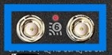

# CompTIA A+ Notes
> Compiled By: Ethan Smith

## Trouble Shooting Methodology
1. Identify the problem
2. Establish a theory of probable cause (question the obvious)
3. Test the theory to determine the cause
4. Establish a plan of action to resolve the problem and implement a solution
5. Verify full system functionality (if applicable, implement preventative measures)
6. Document the findings, actions, and outcomes.

## USB Cables

    
Click to show/hide image and table

    <table>
    <thead>
    <tr>
    <th align="center">Version Name</th>
    <th align="center">Market Name</th>
    <th align="center">Original Name</th>
    <th align="center">Transfer Rate</th>
    <th align="center">Theoretical Speed</th>
    </tr>
    </thead>
    <tbody><tr>
    <td align="center"></td>
    <td align="center"></td>
    <td align="center"></td>
    <td align="center"></td>
    <td align="center"></td>
    </tr>
    <tr>
    <td align="center"></td>
    <td align="center">LowSpeed</td>
    <td align="center">USB 1.0</td>
    <td align="center">1.5Mbps</td>
    <td align="center">0.875MB/s</td>
    </tr>
    <tr>
    <td align="center">USB 2.0</td>
    <td align="center">FullSpeed</td>
    <td align="center">USB 1.1</td>
    <td align="center">12Mbps</td>
    <td align="center">1.5MB/s</td>
    </tr>
    <tr>
    <td align="center"></td>
    <td align="center">HiSpeed</td>
    <td align="center">USB 2.0</td>
    <td align="center">480Mbps</td>
    <td align="center">60MB/s</td>
    </tr>
    <tr>
    <td align="center"></td>
    <td align="center"></td>
    <td align="center"></td>
    <td align="center"></td>
    <td align="center"></td>
    </tr>
    <tr>
    <td align="center"></td>
    <td align="center">(Gen 2) SuperSpeed USB</td>
    <td align="center">USB 3.1GEN1</td>
    <td align="center">5Gbps</td>
    <td align="center">500MB/s</td>
    </tr>
    <tr>
    <td align="center">USB 3.2</td>
    <td align="center">(Gen 2) SuperSpeed USB 10Gbps</td>
    <td align="center">USB 3.1GEN2</td>
    <td align="center">10Gbps</td>
    <td align="center">1212.12MB/s</td>
    </tr>
    <tr>
    <td align="center"></td>
    <td align="center">(Gen 2x2) SuperSpeed USB 20Gbps</td>
    <td align="center">N/A</td>
    <td align="center">20Gbps</td>
    <td align="center">2424.24MB/s</td>
    </tr>
    <tr>
    <td align="center"></td>
    <td align="center"></td>
    <td align="center"></td>
    <td align="center"></td>
    <td align="center"></td>
    </tr>
    <tr>
    <td align="center">USB 4.0</td>
    <td align="center"></td>
    <td align="center"></td>
    <td align="center">40Gbps</td>
    <td align="center">5MB/s</td>
    </tr>
    </tbody></table>

 

## Video Cables

### HDMI (High Definition Multimedia Interface)

1. HDMI Digital Content Protection (HDCP): Allows a device to validate the connection
2. Type A: Regular full-size connector
3. Type C: Mini connector
4. Type D: Micro connector

 - **Category 1 (Standard)** -> Used for video content (1080P/60Hertz)
 - **Category 2 (High Speed)** -> Has great length of distance and high resolution (18Gbps-48Gbps)

### DP (DisplayPort)

1. **Full Size DisplayPort** -> DP
2. **Mini DisplayPort** -> MDP
3. Up to 20Gbps

### DVI (Digital Video Interface)

1. Supports analog and digital outputs
2. DVI-A: Supports analog signals
3. DVI-D: Supports digital signals 
4. DVI-I: Supports analog or digital signals

### VGA (Video Graphics Adapter)

1. Uses a 15-pin standard analog video interface port

### Thunderbolt

1. Acts like a display interface and can do data transfer
2. **Thunderbolt 1 and 2**: Use a physical connector that's backwards compatible with DP
3. **Thunderbolt 3**: Changed the physical interface to use the same port connector as USB-C

- USB-C **does not always** suport Thunderbolt 3, but all Thunderbolt 3 support USB-C
- The maximum cable length for Thunderbolt 3 is **1.6ft**, which provides up to 40Gbps

## Storage Cables

### Thunderbolt

- **Version 1 and 2** -> Uses DP-type connector
- **Version 3 and 4** -> Uses USB-C type connector
- Version 4 will operate on a USB-C port.
- 40Gbps, 2 feet

### Lightning Cable
Specific *proprietary* connector created by Apple for mobile devices

### SATA (Serial Advanced Technology Attachment)
Standard method of connecting a storage decive to a motherboard

- **SATA 7-Pin Data Cable** -> Does not supply power
- **SATA 5-Pin Power Cable** -> Provides the power

1. Version 1 -> Supports speeds of up to 1500Mbps (1.5Gbps)
2. Version 2 -> Supports speeds of up to 3000Mbps (3Gbps)
3. Version 3 -> Supports speeds of up to 6000Mbps (6Gbps)

The ***limitation*** will be the hard drive and not the data cable

### eSATA (External SATA)
Cable outside of the case

- eSATA2 at 3Gbps
- eSATA3 at 6Gbps

Not common anymore

### IDE (Integrated Drive Electronics) Interace
> Renamed
### PATA (Parallel Advanced Technology Attachment)
Uses IDE cables and connectors and standards but is differentiated from SATA

- Doesn't provide power
- *Pin ribbon cable* (Parallel) -> Supports up to two devices and can communicate at the same time 

- **MOLEX Power Connector** -> A 4-pin connector attached directly from the power supply to a device

### SCSI (Small Computer Systems Interface)
Legacy parallel bus connector that allows multiple devices to be daisy chained together (it's slow)

- **Narrow SCSI** -> supports up to 7 devices
- **Wide SCSI** -> supports up to 15 devices

- **High Density Cable - 68 pins** -> Sends data but no power and would need a MOLEX power connector
- **SCA (Single Connector Attachment) - 80 pins** -> Provides power and transfers data

## Motherboards

- **Input** -> Process of accepting data in a form that the computer can use
- **Output** -> Process of displaying the processed data or information
- **Processing** -> Actions performed by the CPU when receiving information. Conducted by the CPU or GPU
- **Storage** -> Process of saving or retaining digital data, temporarily or permanently

- **Temporary/Volatile storage is Non-persistent (RAM)** -> Speed is *fast* (measured in GHz)
- **Permanent/Non-volatile storage is Persistent (Hard Drives)** -> Speed decreases rapidly (measured in MHz)

- Data transferred across the motherboard measures the speed of data in MHz or GHz

### Form Factors
Shape, layout, and type of case and power supply that will be used by the system

- **ATX (Advances Technology eXtended)** -> Full-size motherboard and measure 12" x 9.6" in size (305mm x 244mm)
- **mini-ATX** -> Smaller than ATX but contains the same features (11.2" x 8.2" / 284mm x 208mm)
- **mATX (micro-ATX)** -> Measures 9.6 inches squared (244mm x 244mm)
- **ITX (Information Technology eXtended)** -> Designed as replacement for the ATX but ***never produced***
- **Mini-ITX** -> Measures 6.7" x 6.7" with only one expansion slot (170mm x 170mm)

### CPU (Central Processing Unit) Architecture

- **X86 (IA-32 / Intel Architecture-32)** -> Developed by Intel with an 8-bit, 16-bit, and up to 32-bit instruction set
  - Can only support a maximum of 4GB of RAM
  - Can only run 32-bit programs
- **X64** -> Supports 64-bit instruction set
  - Can support up to 2.3EB of RAM (1,300,000TB)
  - Can run 64-bit and 32-bit programs
- **ARM (Advanced RISC Machine)** -> Used for low-power devices (tablets and cell phones)
  - **RISC** -> Reduced Instruction Set Computing
  - Extended battery life
  - Produces less heat
  - **RISC** systems use code to do tasks

### CPU Sockets

- **ZIF (Zero Insertion Force)** -> Inserts the CPU without pressing down and giving no pressure
- **LGA (Land Grid Array)** - (Intel) Form factor that positions all pins to connect the CPU processor into the socket
- **PGA (Pin Grid Array)** - (AMD) Form factor where the processor has the pins and the socket has the holes

A *single socket* architecture on desktop motherboards can only support on physical processor
A *multi-socket* can have multiple CPUs or processors installed on the motherboard (usually for servers/high-end workstations)

- **Intel Desktop Socket** -> LGA 2011. LGA 1151, LGA 2066
- **AMD Desktop Socket** -> AM2, AM3, AM4

### CPU Features

- **SMT (Simultaneous MultiThreading; generic term)/Hyper-Threading (Intel)** -> Single stream of instructions is being sent by a software application to a processor
- **SMP (Symmetric Multiprocessing)** -> Traditional workstation and servers have multiple processors
- **Multi-core Processors** -> Single CPU with muliple processors inside
  - **Dual-core** -> two CPUs inside a single chip
  - **Quad-core** -> Four CPUs inside a single chip
  - **Hexa-core** -> Six CPUs inside a single chip
  - **Octa-core** -> Eight CPUs inside a single chip
- **Virtualization** -> Pretend there are other computers inside itself
  - VT (Intel)
  - AMD-V (AMD)
  - Provide processor extensions to support virtualization 

> Understand that some computers have these capabilities providing better performance than those that do not.

### Motherboard Connectors
> 

#### CPU Socket
> 

#### Memory Sockets
> 

#### Main Power 
> 

#### CPU Power
> 

#### Case Fan Power
> 

#### USB Header Port
> 
> 

#### Power LED Connector
> 

#### Audio Header Port
> 

#### PCIe x1 (expansion slot)
> 

#### PCIe x16 (expansion slot)
> 

#### M.2 Connector
> 
> 

#### CMOS Batter
> 

#### SATA Ports
> 
> 

#### Rear Port Cluster
> 
> 

#### USB 2.0
> 

#### PS2 Keyboard/Mouse Port
> 

#### HDMI and DP
> 

#### SuperSpeed USB 3 / USB 3 10Gbps 
> 
> 

#### RJ45 Network Jack (2.5Gbps)
> 

#### SuperSpeed USB 3 Type C (10Gbps)
> 

#### WiFi 6 Antenni Connectors
> 

#### Audio Cluster
> 

### Installing a Motherboard

1. Review the motherboard's documentation 
2. Position the motherboard to align with the rear of the case
3. Insert the standoffs to match the hole locations on the motherboard
4. Install the processor and memory modules before installing the motherboard
5. Verify the standoffs are properly aligned prior to installing the motherboard
6. Secure the standoffs with the appropriate screw type
7. install the power supply, disk drives, add-on cards, and other components

### Expansion Cards

- Mostly used for Network and Audio cards because they were slow
  - **PCI** -> 32-bit cards. Only supports maximum bus speed of 33MHz or 133MBps
  - **PCI-X** -> 64-bit expansion card (133MHz)
  - **PCI-X 2.0** -> 266MHz up to 533MHz
- **AGP (Accelerated Graphics Port)** -> Used for video graphics cards
  - AGP 1x, 2x, 4x, 8x 
- **PCIe (Peripheral Component Interconnect Express)** -> replaces PCI, PCI-X, and AGP
  - **PCIe x1** -> Used for modems, network cards, wireless cards, input/output devices, and audio cards
  - **PCIe x4 and PCIe x8**
  - **PCIe x16** -> Used for graphics cards
  - PCIe x1 will be slower than PCIe x16.
  - All PCIe slots provide **25 watts of power**
  - PCIe x16 card slot provides up to **75 watts of power**
  - **Up-Plugging** -> Putting smaller card in a larger slot
  - **Down-Plugging** -> Putting larger card in a smaller slot (card has to support Down-Plugging or it won't fit)
  - **Mini PCIe** -> Smaller form fact used inside of laptops, specifically for wireless networking

Motherboard has limited lanes; x1, x4, x8, x16 are the lanes the PCIe uses
If the motherboard has 24 lanes and you are using 2 PCIe x16 GPUs, the 32 lanes of information have to slow down to go through the 24 available lanes the motherboard has.

> **Remember**
> In modern computers, the expansion slots you'd see are PCIe x1 and x16.

### Types of Expansion Cards

- **Video Card/Graphic Adapte**r -> Gives quality signals to monitors
  - **GPU (Graphics Processing Unit)** -> Specialized processor designed to accelerate graphics rendering
  - **High Speed Memory** -> Embeds the memory to give addition capability to offload from the system
  - **Graphical Ports** -> Installed outside of the card (Thunderbolt, DisplayPort, and HDMI)
- **Video Capture Card** -> Takes video signals and processes them inside the computer
- **TV Capture Card** -> Cables are plugged into a computer to get all cable TV channels
- **Sound/Audio Card** -> Gives better output through audio
- **NIC (Network Interface Card)**
  - RJ45
  - **ST / SC / MT-RJ connector** -> Supports fiber card
  - WiFi capability
- **Riser Card** -> Special type of expansion card on a motherboard
  - A smaller pc may not fit a full graphics card so a Riser card moves the PCIe slots to be parallel to the motherboard
    

## Cooling and Power

### Cooling System

- **Passive Cooling** -> Type of cooling that doesn't rely on moving parts or power
  - **Heatsink** -> Finned metal device that radiates heat away from the processor
  - **Thermal Paste** -> Compound that ensures heat transfer by eliminating air gaps
- **Active Cooling** -> Uses a fan to cool down the heat from the device
  1. Top of the processor
  2. Case fans
  3. Back of the power supply
  4. External graphics cards

### Liquid Cooling

- In High performance systems
- **Closed loop system** -> cooling of a single component
- **Open loop system** -> Liquid cooling based system of different components
- **Water** and **liquids** are more effective coolants than air convection

### PSU (Power Supply Unit)

- AC (Alternating Current) is cycled between positives and negatives repeatedly
- **Modular PSU / Modular Power Supply Unit** -> Allows to unhook the connectors and detatch from the unit

#### Power Supply Connectors

- **Main Board / Motherboard Adapter** -> Provides power to the motherboard
  - **ATX Standard** -> 20-pin connector
  - **ATX 12V** -> 24-pin connector (almost all)
  - **20+4 Pin** -> Two connectors are coupled together before pluggin into a 4-pin connector
- **Processor Power/CPU Power** -> Has a four, six, or eight-pin connector
- PCIe Adapter Card
- **SATA Power Connector** -> Used to power the SATA Drive
- **Molex Connector** -> Used for IDE and PATA hard disks, CDs, and DVD drives
- **Y Connector** -> One connector that can support multiple devices

#### Input Voltages
- **120V AC (Low Line Power)** -> US-based power supply
- **230V AC (High Line Power)** -> Europe and Asia power supply

#### Most power supplies will support mult-voltage outputs
- **Voltage Sensing/ Dual Voltage Power Supplies** -> Detects the outlet and converts it into the voltage of DC

#### Output Voltages
- +3.3VDC
- +5VDC
- +12VDC
- -12VDC
- **Rail** -> Wire that provides current at a particular voltage
- **12 VDC Rail** -> Cable or wire that provides 12 VDC
- 12 VDC is the most commonly used voltage in the PC

#### Wattage Rating -> Power supply's output capacity or capability

- Watts = Voltage*Current(Amps)

## System Memory

- **Cache** -> High-speed memory
- RAM (Random Access Memory) / System Memory -> Temporary storage area/ non-persistent storage
- **Storage** -> Mass storage device that holds more data but is slower than a cache. Permanent storage area/ persistent storage
- **Disk Cache** -> Pulls the files from the disc into memory and replaces the old file

### Addressing Memory -> Processor reaching the files inside RAM
- **32-bit (x86)** -> 4 billion address location (4GB of data)
- **64-bit (x64)** -> 184 quintillion address locations (16EB of data)

### Memory Modules
- **Single Bank** -> Can put any size module in any slot
- **Paired Bank** -> Requires installation of banks in pairs
- DIMM (Dual Inline Memory Modules)
- DDR3, 4, 5 (Dual Data Rate)
- RDRAM (Rambus Dynamic Random Access Memory)
- **Throughput** -> Calculated based on the bus speed and the width of the databus

#### In historical order

- **DRAM (Dynamic RAM)** -> Oldest Type of memory that requires frequent refresh
  - DRAM storage cell is dynamic
- **SRAM (Static RAM)** -> Solved the issue of the constant refresh, but was expensive
- **SDRAM (Synchronous DRAM)** -> First memory module that operates at the same speed as the motherboard bus
  - PC66 (66 MHz bus)
  - PC133 (133 MHz bus)
  - PC266 (266 MHz bus)
- **DDR SDRAM (Double Data Rate Synchronous Dynamic RAM)** -> Doubles the transfer speed of an SRAM module (184-pin connector)
- **DDR2 SDRAM (Double Data Rate 2 Synchronous Dynamic RAM)** -> Higher latency and has faster access to the external bus (240-pin connector)
  - **PC2-4200** -> 4200MB/s Throughput
- **DDR3 SDRAM (Double Data Rate 3 Synchronous Dynamic RAM)** -> Runs at a lower voltage and at a higher speed than DDR2 (240 keyed pin connector)
  - **PC3-10600** -> 10600 MB/s Throughput
  - 6.4 - 17 GB/s with a maximum module size of 8GB per memory module
- **DDR4 (Double Data Rate 4)** -> 12.8 to 25.6 GB/s of throughput; 32 GB per module
- **DDR5 (Double Data Rate 5)** -> 38.4 to 51.2 GB/s of throughput; 128 GB per module

> Do not need to know the limits of speed for each modules type/version. You should, however, know that PC4-16000 signifies that is has that 16000 MB/s or 16GB/s of throughput being specified. Note the keyings are different

- **A mix and match of middules is possible with the same type and different speeds** -> the faster module will slow itself to match speeds

- **SODIMM (Small outline Dual In-line Memory Module)** -> Still classified as DDR4, DDR4, or DDR5
  - SODIMM PC4-16000 (16GB/s)
  - Smaller form factor for laptops

### Multi-Channel Memory -> Uses two different memory module to increas the performance and throughput
Just because a motherboard has 4 slots doesn't mean it supports Quad-Channel. 
 
- **Single-Channel** -> Uses one memory module on one bus (64-bit data bus)
- **Dual-Channel** -> Requires two memory modules and two memory slots on the motherboard (128-bit data bus)
- **Triple-Channel** -> Uses three memory modules and three memory slots (192-bit data bus)
- **Quad-Channel** -> Uses four memory modules and four memory slots on the motherboard (256-bit data bus)
- In **multi-channel** configurations, use the same model, speed, and throughput of memory so no module has to slow down for another.

### ECC (Error Correction Code) Memory

- **Non-Parity Memory** -> Standard memory that does not check for errors and allows data to be put in or taken out
- **Parity Memory** -> Performs basic error checking and ensures the memory contents are reliable
- **ECC (Error Correction Code)** -> Detects and corrects an error
- Buffered/Registered Memory -> Additional hardware (register) between memoru and CPU

> Motherboard and Memory module have to support ECC to utilize it

- DDR5 has internal error checking for its modules but is not considered Error Correcting Code
- DDR5 can still have ECC or non-ECC capabilities but this is separate from the internal Error checking

### Virtual Memory/Page File -> Space on a hard drive that is allocated by the OS and pretends to be memory

- Page file (Windows) and Swap Space (Linux Unix/ Mac)
  - A page file or swap space is hidden on a storage device and pretends to be system memory
  - Chunks are 4KB-sized
  - *slow*

## BIOS (Basic Input/Output System) / UEFI (Unified Extensible Firmware Initiative)
- **BIOS** -> Program that a computer's microprocessor uses to start and boot the computer system after being turned on (32-bit)
- **Firmware** -> Software on a chip and contains BIOS program code in the flash memory of the motherboard
- **UEFI** -> Supports 64-bit processors and provides a GUI (Graphical User Interface)

### Boot Options
- **POST (Power-On Self-Test)** -> Diagnostic testing sequence to check the computer's basic input/output system
  - Variable beeps are used as a way to tell what is wrong with the system. Useful if video is not displaying.
- **Read-Only Memory (ROM)** -> Type of chip embedded in the motherboard and can be upgraded through flashing
- **UEFI** -> Updated form of BIOS that allows keyboard and mouse as input and provides a GUI
  1. Supports 64-bit systems
  2. Supports larger HDDs and SSDs (9.4 zettabytes ~ 9,4 x 10^21 bytes)
  3. Supports the new GUID Partition Table (GPT) format (BIOS only supports MBR/Master Boot Record)
  4. Faster boot-up
  5. Uses a larger ROM size (better tools and commands)
- **Flashing** -> Performed during upgrades, security fixes, or feature improvements
  1. Back up the configuration and information
  2. Use a USB flash drive to flash the firmware
  3. The BIOS or UEFI will copy the firmware to the system and overwrite the old code

### Security
> BIOS and UEFI are two different types of firmware which are used during the loading and booting up of the OS.
> A system will have a BIOS or UEFI but *not* both

- Computers that rely on BIOS use the MBR (Master Boot Record) to hold the boot information
- Computers that rely on UEFI use the GPT (GUID Partition Table) to hold the boot information
- BIOS/UEFI Passwords
  - Supervidor/Administrator/Setup Password -> Used to protect acces to the BIOS or UEFI configuration program and prevents access from unauthorized users
  - User/System Password -> Used to lock access to the computer
  - Storage/Hard Drive Password -> Password that locks access to a hard drive connected to the system and requires the end user's password
- **Secure Boot** -> Enabled in the UEFI interface and settings and is not supported by a BIOS
Boot Process

- Modern systems are configured to enable or disable the USB ports on the motherboard
  - Disabling the ability of USB to read and write from mass storage device to stop malware being introduce

> Remember -> When it comes to security, there are 3 main things the BIOS or UEFI can provide you with
1. Set passwords
2. Enable secure boot
3. Restrict or disable USB ports

### TPM (Trusted Platform Module) and HSM (Hardware Security Module)

> First, Hardware RoT (Root of Trust) is the foundation of all secure operations of the computer system
- **Hardware Root of Trust** -> Cryptographic module embedded in a computer system that endorses trusted execution and attests to boot settings and metrics
> A hardware RoT is used to scan the boot metrics in the OS files to verify signatures and then use them to sign the report
- **TPM (Trusted Plateform Module)** -> Specification for hardware-based storage of digital certificates, keys, hashed passwords, and other use and platform identification information
  - TPM is a hardware RoT
  - Secured boot-up
  - Provides encryption
- **HSM (Hardware Security Module)** -> Application for generating and storing cryptographic keys that is less susceptible to tampering and insider threats

### Cooling Options 

- **Quiet mode** -> Reduces the fan speed and allows higher temperatures to occur
- **Balanced mode** -> Normal setting on most computers by default
- **Cool mode** -> Able to run the fans harder and faster to create more air flow
- **Fanless** -> No fans, obviously
 

## Storage Devices

### Types of Storage Device

- **Internal Devices** -> Device that is placed inside the computer case or tower
- **External Devices** -> Deviced that is placed outside the computer case or tower and connected to an external port
- **2.5" and 3.5" Drive** -> Reserved for internal HDDs and SSDs
- **5.25" Drive** -> Reserved for optical drives, backup tape drives, and floppy disc drives
- **HDD (Hard Disk Drive)** -> Uses mechanical parts to read and write to a platter for persistent mass storage
  - **5400 RPM** -> Slowest model (budget or low-end workstations and PCs)
  - **7200 RPM** -> Faster Performance (modern computers)
  - **10000 RPM** -> High-Performance drives (gaming PCs)
  - **15000 RPM** -> Highest RPM and highest cost, but provides excellent performance
  - **Buffer Size** -> Internal buffer or cache on a hard disc drive (8MB to 256 MB)
  - Slower Speeds, Less expensive
- **SSD (Solid State Drive)** -> Uses flash memory technology to implement persistent mass storage
  - **2.5" SSD** -> Used when replacing an HDD inside of a laptop or small desktop
  - **1.8" SSD** -> Used inside of small laptops
  - **M.2 SSD** -> Like a memory chip, small, sleep and light to use in a laptop
  - Higher Speeds, More expensive
- **Hybrid Drive** -> 

### Storage Device Connections

- SATA 7-Pin Data Cable + 15-Pin Power Cable
  - **SATA 1** -> Maximum speed of 1.5Gbps (150 MB/s of throughput)
  - **SATA 2** -> Maximum speed of 3 Gbps (200 MB/s of throughput)
  - **SATA 3** -> Maximum speed of 6 Gbps (600 MB/s of throughput)
- **mSATA** -> Allows the SSD to be used as an adapter card that can be plugged into a combined data and power port on the motherboard
- **NVMe** -> A communcation protocol used with the M2 form factor to plug directly into the motherboard
- **PCIe** -> There are some SSDs which can connect to PCIe for faster speed than SATA but slower speeds than NVMe
- **SCSI** -> Supports either 7 or 15 devices in a daisy chain
  - **Narrow SCSI** -> 40 Mbps
  - **Wide SCSI** -> 320 Mbps

### RAID (Redundant Array of Independent Disks) -> Combination of multiple physical hard disks that is recognized by the operating system

- RAID 0 (Striping) 

  - great for speed but provides no data redundancy
  - no loss of space on the disks
- RAID 1 (Mirror and Redundancy) 

  - provides **full redundancy**
  - half the total storage
- RAID 5 (Redundancy through Parity) 

  - Minimum 3 disks
  - Any parity disk in space dedicated is number of disk parity
- RAID 6 (Striping with Dual Parity 5+1) 

- RAID 10 (Mirroring + Striping) 

1. Failure Resistent -> Protection against the loss of erased data
  - RAID 1
  - RAID 5
2. Fault Tolerant ->RAID can function even when a component fails
  - RAID 1
  - RAID 5
  - RAID 6
3. Disaster Tolerant -> RAID with two independent zones with full data access
  - RAID 10

### Removable Storage

- **Hot-Swappable** -> Capable of being removed or replaced without disrupting or powering off the system
  - USB
  - Thunderbolt
  - eSATA
  - Safe to remove without losing the data
- **AHCI (Advanced Host Controller Interface)** -> Technical standard developed by Intel that allows hot-swappable capability with SATA devices
- **Drive Enclosure** -> Takes an internal hard drive and put in an enclosure
- SD
  - **Original** -> 25MB/s
  - **UHS-1** -> 108 MB/s
  - **UHS-2** -> 312 MB/s
  - **UHS-3** -> 624 MB/s
- MiniSD
- MicroSD
- CompactFlash
- Memory Stick
- Tape Drive
  - **Standard Type** -> 140 GB
  - **LTO Ultrium Tape** -> 3 TB
- Floppy Drives
  - 1.44 MB

> Remember
- A removable mass storage device is any device that can store data and can be carried
- An external hard drive or SSD is the same type of device that is used inside the system

### Optical Drive
- **CD (Compact Disc)** -> Oldest form of optical drive that stores 74 to 80 minutes of music (650-700MB)
  - **1x** -> 150 KB/s
  - **2x** -> 300 KB/s
  - ... 150x# KB/s
  - **52x** -> 7800 
- **DVD (Digital Versatile Disc)** -> Stores 4.7 GB or 8.4 GB DL (Dual Layer)
  - **1x** -> 1.385 MB/s
- **BD (Blue-ray Disc)** -> Stores 35GB or 50GB (DL)
  - **1x** -> 4.5 MB/s
- Read-only (ROM)
  - CD-ROM, DVD-ROM, BD-ROM is a read-only disc
- Write-once (R)
  - CD-R, DVD-R, DVD+R and BD-R
  - Writing that cannot be erased
- Write-many/Erasable (RW/RAM/RE)
  - **CD-RW** -> allows to write and erase the file to create a new one
  - DVD-RW, DVD+RW, DVD-RAM
  - **BD-RE** -> Has write-many type of disc called erasable disc

> Remember
- **CD** -> 650–700 MB
- **DVD** -> 4.7 GB or 8.4 GB (DL)
- **Blu-ray** -> 25 GB or 50 GB (DL)

## Virualization -> Host computer installed with a hypervisor that can be used to install and manage multiple guest operating systems or virtual machines (VMs)

- **Type 1 Hypervisor (Bare Metal)** -> Runs directly on the host hardware and functions as the operating system
- **Type 2 Hypervisor (Hosted)** -> Runs withing the normal operating system

- **Terminal Services** -> Server-based solution that runs the application on servers in a centralized location
- **Application Streaming** -> Client-based solution that allows an application to be packaged up and streamed directly to a user's PC.
- **VDI (Virtual Desktop Infrastructure)** -> hosts desktop OSs within a virtualized environment hosted by a centralized server or server farm
- **Sandbox** -> An isolated environment for analyzing pieces of malware
- **Cross-Platform Virtualization** -> Allows for the testing and running of software applications for different operating systems
- **Emulation** -> System imitation (different processor than available with host)
- **Virtualization** -> New "physical" machine (limited to our processor)

### Containerization -> Type of virtualization applied by a host operating system to provision an isolated execution environment for an application

1. When a physical server crashes, all the organizations hosted on that same server are affected
2. An organization's failure to secure the virtual environments hosted on a shared server poses a security risk for the other organization

### Resource Requirements

- **Virtualization** -> Pretend there are other computers inside itself
  - VT-x (Intel)
  - AMD-V (AMD)
  - **SLAT (Second Level Address Translation)** -> Improves the performance of virtual memory when running multiple virtual machines on a single physical host (faster virtualization of RAM)
    - **Intel** -> EPT (Extended Page Table)
    - **AMD** -> RVI (RApid Virtualization Indexing)

- **System Memory** -> Amount of physical memory installed on a physical server

### Security Requirements

- **VM Escape** -> Threat attempts to get out of an isolated VM and send commands to the underlying hypervisor
- **VM Hopping** -> Threat attempts to move from one VM to another on the same host
- **Sandbox** -> Separates running processes and programs to mitigate system failures or software vulnerabilities
- **Sandbox Escape** -> Occurs when an attacker circumvents sandbox protections to gain access to the protected OS or other privileged processes
- **Live migrations** -> Migrates the virtual machine from one host to another over the network
  - Only do this on a trusted network or encrypted connection.
- **Data Remnants** -> Leftover pieces of data that may exist in the hard drive which are no longer needed
  - Encrypt virtual machine storage location
  - Destroy encryption key when no longer needed
- **VM Sprawl** -> Uncontrolled deployment of virtual machines

## Cloud Computing

### Charcteristics of the Clou

- **High Availability** -> Services experience very little downtime when using the cloud
  - Availability is the percentage of uptime versus downtime
  - 99.999% uptime (5 minutes and 15 seconds of downtime in a year)
- **Vertical Scaling (Scaling Up)** -> Increasing the power of existing resources in the working environment
- **Horizontal Scaling (Scaling Out)** -> Adding additional resources to help handle the extra load being experienced
- **Rapid Elasticity** -> Ability to quickly scale up or down
  - Elasticity is the system's ability to handle changes to demand in real time
- **Metered Utilization** -> Being charged for a service on a pay per use basis
- **Shared Resources** -> Ability to minimize the costs by putting VMs on other servers
- **File Synchronization** -> Ability to store data which can then spread to other places depending on configuration

### Cloud Deployment Models

1. Public -> Systems and users interact with devices on public networks, such as the Internet and other clouds
2. Private -> Systems and users only have access with other devices inside the same private cloud or system
3. Hybrid -> Combination of private and public clouds
- **Community** -> Collaborative effort where infrastructure is shared between several different organizations with common service needs
- **Multitenancy** -> Allows customers to share computing resources in a public or private cloud
- **Single-Tenancy** -> Assigns a particular resource to a single organization

### Cloud Service Models

- **On-Premise Solution** -> Needs to procure hardware, software, and personnel necessary to run the organization's cloud
- **Hosted Solution** -> Third-party service provider that provides all the hardware and facilities needed to maintain a cloud solution
  - AWS, Google Cloud, Linode Akamai, ... 
- SaaS (Software as a Service)
  - Google Docs, Office 365, Gmail, turbotax, ... 

- PaaS (Platform as a Service)
  - Not giving code/application.  

- IaaS (Infrastructure as a Service) 

> Hint: If you see something that is More than IaaS or less than SaaS then choose PaaS since the lines for it are unclear

> Remember
- **IaaS** -> Provides everything you need to run a server (sometimes will let you choose OS)
- **PaaS** -> OS and Infrastructure like Apache Webserver, MySQL Database which you develop on top of

### VDI (Virtual Desktop Infrastructure) -> Hosts desktop OSs within a virtualized environment hosted by a centralized server or server farm

- **Centralized Model** -> hosts all the desktop instances on a single server or server farm
- Hosted Model/ Desktop as a Service (DAAS) -> Maintained by a service provider and provided to the end user as a service
- **Remote Virtual Desktop Model** -> Copies the desktop image to a local machine prior to being used by the end user

### Cloud Storage Services

- **Cloud Storage Applications** -> Amount of space on a cloud-based server as file storage
  - Dropbox
  - Google Drive
  - OneDrive
- **File Syncronization** -> Ability to synchronize from different devices using a single account
- **CDN (Content Delivery Network)** -> Network of servers that locates the nearest server to minimize delay or download time

### SDN (Software-Defined Networking) -> Enables the network to be intelligently and centrally controlled, or programmed, using software applications

- **Application Layer** -> Focuses on the communication resource requests or information about the network as a whole
- **Control Layer** -> Uses the information from the applications and decides how to route a data packet on the network
- **Infrastructure Layer** -> Contains the network devices that receive information about where to move the data
- **Management Plane** -> Used to monitor traffic conditions and the status of the network

> Remember: That Software-Defined Networking can be broken down into four layers
1. the Application Layer
2. The control Layer
3. The Infrastructure Layer
4. Management Plane

## Networking Basics

### Networking Hardware

- **NIC (Network Interface Card)** -> Provides an ethernet connection to the network
- **HUB** -> Has a number of different ports between 4 and 48 ports (Broadcast Collision Domain)
  1. Collision
  2. Uncover ears and listen to traffic
- **Switch** -> Smart hubs that remember the ports that are connected to them
  - Switched can have multiple people talking at one time
  - **Unmanaged Switch** -> Performs its functions without requiring a configuration
  - **Managed Switch** -> Performs its functions with configuration
- **Wireless Access Point** -> Device that allows wireless devices to connect to a wired network
- **Router** -> Used to connect different networks together
- **Firewall** -> Scans and blocks traffic that enters or leaves a network
  - **UTM (Unified Threat Management)** -> contains firewall features
- **Patch Panel** -> Device that allows cable network  jacks from a wall into a central area
- **PoE (Power over Ethernet)** -> Supplies electrical power from a switch port over an ordinary data cable to a power device
  - **802.3af** -> Allows the least amount of power to be drawn (13W)
  - 802.3at (PoE+) -> Allows power devices to draw up to 25W
  - 802.3bt (PoE++) -> Used to supploy power of up to 51W (Type 3) or 73W (Type 4)
  1. Switch that supports PoE at one of the three levels
  2. Proper cabling in place for support (Cat 6 or above)
  3. Power device to use the data and power coming from the ethernet cable
  - Power injector plugs into wall outlet and can take an ethernet cable from a switch that doesn't support PoE and supply the power into the cable 

- **Cable Modem** -> Device that translates coaxial cable signals into radio frequency waves
- **DSL (Digital Subscriber Line) Modem** -> Device that translates coaxial cable signals into phone lines
- **ONT (Optical Network Terminal)** -> Terminates fiber connection
- **SDN (Software Defined Networking)** -> Way of virtualizing the network hardware

### Network Types

- **PAN (Personal Area Network)** -> Smallest type of wired or wireless network and covers the least amount of area
- **LAN (Local Area Network)** -> Connects components within a limited distance (~300 feet)
  - **Ethernet** -> IEEE 802.3
  - **Wi-Fi** -> IEEE 802.11
- **CAN (Campus Area Network)** -> Connects LANs that are building-centric across a university, industrial park, or business place (~few miles)
- **MAN (Metropolitan Area Network)** -> Connects scattered locations across a city or metro area (~25 miles)
- **WAN (Wide Area Network)** -> Connects geographically disparate internal networks and consists of lease lines or VPNs (Worldwide coverage)

- **WLAN (Wireless Local Area Network)** -> A wireless distribution method for two or more devices that creates a local area network using wireless frequencies
- **SAN (Storage Area Network)** -> Provisions access to configurable pools of storage devices that can be used by application servers
  - iSCSI (Interet SCSI)
  - FC (Fiber Channel)
- SoHo (Small Office, Home Office) LAN -> Uses a centralized server or simply provides clients access to local devices like printers, file storage, or the Internet

### IoT (Internet of Things)
> A global network of appliances and personal devices that have been equipped with sensors, software, and network connectivity to report state and configuration

1. Hub and control systems
2. Smart devices
3. Wearables
4. Sensors

### Twisted Pair Cables

- UTP (Unshielded Twisted Pair)
- STP (Shielded Twisted Pair)
- Connectors
  - **RJ (Registered Jack)** -> Carries voice or data which specifies the standard a device needs to meet in order to connect to the phone or data network 

- **Bandwidth** -> The theoretical measure of how much data could be transferred from a source to its destination
- **Throughput** -> The actual measure of how much data is successfully tranferred from a source to its destination
> ***You need to know these***
- **Ethernet Standard** -> A designation given to a particular catefory that provides the ability to understand the bandwidth and the cable type to be used 

> **All together so you remember. Here is a summarized chart to memorize**

> Yes, the maximum cable length is a 100 meters, but that's often the maximum, not the minimum. Oftentimes in the real world, you're going to see that you can't get a full a 100 meters in cable length from these type of cables because there's interference from fluorescent lights and other sources of EMI.
- **Straight-Through Cable (Patch Cable)** -> Contains the exact same pinouts on both ends of the cable
- **568B Standard** -> Preferred when wiring jacks inside building
- **Crossover Cable** -> Swaps the send and receive pins on the other end of the cable when the connector andits pinout are created 

> **For the exam**, a switch to a switch connection requires a crossover cable
- **MDIX (Medium Dependent Interface Crossover)** -> An automated way to electronically simulate using a crossover cable
  - If a switch doesn't suppor MDIX then you have to use a crossover cable
> Remember the colors for 568A and 568B standards

- **Direct Burial** -> a cable rating that specifies that a cable has a stronger sheathing and jacket that can withstand more extreme weather conditions
- **Plenum Cable** -> A speial coating put on a UTP or STP cable that provides a fire-retardant chemical layer to the outer insulating jacket
  - for ceilings, walls, raised floors, or air ducts

### Fiber Optic Cabling -> Uses light from an LED or laser to transmit information through a thin glass fiber
  - Greater usable range
  - Greater data capacity
  - Switches, routers, and end-user devices can become a limitation
  - Expensive (5-10x more than copper cabling)
  - Difficult to work with
  - SMF (Single Mode Fiber) -> Used for longer distances and has smaller core size which allows for only a single mode of travel for the light signal
  - MMF (Multimode Fiber) -> Used for shorter distances and has larfer core size which allows for multiple modes of travel for the light signal

> Remember  

> - **Yellow** -> SMF
> - **Aqua** -> MMF
> - **SC (Subscriber Connector)** -> Stick Click 

> - **ST (Straight Tip Connector)** -> Stick and Twist 

> - **LC (Lucent Connector)** -> Love Connector 

> - **MTRJ (Mechanical Transfer Register Jack)** 

### Coaxial Cabling -> One of the oldest categories of copper media that is still used in networking today

- RG-6 and RG-59 

- Connectors
  - F-type (most common)
  - BNC (older) 
  

- Twinaxial -> Similar to coaxial cable but uses two inner conductors to carry the data instead of just one

### RJ45 Cable Standard -> 1, 2, 3, 6

> Don't go over 100 meters

## Wireless Networks

### Wireless Frequencies
- DSSS (Direct-Sequence Spread Spectrum) -> Modulates data over an entire range of frequencies using a series of signals known as chips
- FHSS (Frequency-Hopping Spread Spectrum) -> Allows devices to hop between predetermined frequencies
- OFDM (Orthogonal Frequency Division Multiplexing) -> Uses a slow modulation rate with simultaneous transmissions over 52 different data streams

> You really only need to recognize that these three words are referring to something in the wireless networking world.
Each band has specific frequencies/channels to avoid overlapping with other frequencies
- Channel -> A virtual medium through which wireless networks can send and recieve data
- 2.4 GHz
  - 11 Channels (United States) -> 2401-2473MHZ
  - 13 (Rest of the world) -> 2401-2483MHz
  - 14 (Japan) -> 2401-2495 MHz
  > **1, 6, and 11** avoid overlapping frequencies in the **2.4** GHz band
- 5 GHz

> remember
> - The standard charnnel size for both 2.4 and 5 GHz networks is 20 MHz
> - On a 5GHz network, you are able to bond channels to be 2x, 4x, 8x. This increases network speeds but increases chance of conflicting frequencies

### Wireless Standards
> Need to know the Standard, Band, and Bandwidth

- MIMO (Multiple-Input and Multiple-Output) -> Uses multiple antennas to send and receive data than it could with a single antenna
- MU-MIMO (Multiple User Multiple-Input and Multiple-Output) -> Allows multiple users to access the wireless network and access point at the same time
- RFI (Radio Frequency Interference) -> Occurs when there are similar frequencies to wireless networks in the area
 
### Wireless Security
- Pre-Shared Key -> Both the access point and the client use the same encryption key
- WEP (Wired Equivalent Privacy) -> Original 802.11 wireless security standard which is an insecure security protocol
  - Uses a 24-bit Initialization Vector (IV) sent in clear text
- WPA (Wi-Fi Protected Access) -> Replaced WEP and follows the TKIP (Temporal Key Integrity Protocol)
  - WPA uses 48-bit Initialization IV instead of 24_bit
  - RC4 (Rivest Cipher 4) -> For encryption
  - MIC (Message Integrity Check) -> To confirm data was not modified in transit
  - Enterprise Mode -> To authenticate users before exchangin keys
  - Considered Weak
- WPA2 (wi-Fi Protected Access 2) -> Created as part of IEEE 802.11i standard and requires stronger encryption and integrity checking through CCMP
  - CCMP should remind you of WPA2
  - Replaces RC4 with AES
  - AES (Advanced Encryption Standard) -> To provide additional security by using a 128-bit key or higher
  - Personal Mode -> Pre-shared key
  - Enterprise Mode -> Centralized authentication

> Remember

- MAC Address Filtering -> configures an access point with a listing of permitted (whitelisted) or denied (blacklisted) MAC addresses (like an ACL)
- Disabling SSID Broadcast -> Configures an access point not to broadcast the name of the wireless LAN
### Fixed Wireless

1. Wi-Fi (802.11) -> When it comes to fixed wireless, creates point to point connections from one building to another over a relatively short distance
  - Usually using directional antennas
2. Cellular -> Uses a larger antenna and a larger hotspot powered by a power outlet within an office or home
3. Microwave -> Creates point to point connection between two or more buildings that have longer distances
  - 40 miles
4. Satellite -> A long range and fixed wireless solution that can go for miles
  - Low Earth Orbit -> Requires more satellites to cover the entire planet but give lower latency speed
  - Geosynchronous Orbit -> One satellite can cover a large portion of the Earth; higher latency and lower quality.

### NFC, RFID, IR, and Bluetooth

- NFC (Near Field Communication) -> Uses radio frequency to send electromagnetic charge containing the transaction data over a short distance
- RFID (Radio Frequency Identification) -> A form of radio frequency transmission modified for use in authentication systems
- IrDA (Infrared Data) -> Allows two devices to communicate using line of sight communication in the infrared spectrum
- Bluetooth -> Creates a personal area network over 2.4GHz to allow for wireless connectivity
  - Bluejacking -> Sending unsolicited messages to a bluetooth device
  - Bluesnarfing -> Making unauthorized access to a device via Bluetooth connection
  - BlueBorne -> Allows the attacker to gain complete control over a device without even being connected to the target device
- Tethering -> Sharing cellular data internet connection from a smartphone to multiple other devices

### Configure a Wireless Network

- Use WPA2 with a good, long, strong pre-shared key
- Disable SSID broadcast
- Enable Wireless Isolation
- Enable MAC filtering
- Disable WPS setting

## Internet connection

- ISP (Internet Service Provider) -> Establishes high speed links between their network and clients

### Dial-up and DSL

- POTS (Plain Old Telephone System) -> Runs as a dial-up connection and is used on the public switched telephone network (PSTN)
  - Dial-up modems have a maximum bandwisth of 53.3 kb/s
- Legacy System -> Old system that is still used in some critical functions
- ISDN (Integrated Service Digital Network) -> Supports multiple 64 Kbps channels
- DSL (Digital Subscriber Line)
  - ADSL (Asymetric DSL) -> Has different speeds of download and upload
    - Maximum Distance to DSLAM -> 18,000 ft.
    - Maximum Download Speed -> 8 Mbps
    - Maximum Upload Speed -> 1.544 Mbps
  - SDSL (Symetric DSL) -> Has same speeds of download and upload
  - VDSL (Very High Bit-Rate DSL) -> Has high speeds of download and upload
    - Maximum Distance to DSLAM -> 4,000 ft.
    - Download Speed -> 50 Mbps or more
    - Upload Speed -> 10 Mbps or more

### Cable Connections

- Cable Modems -> Used a cable TV network that is made up of a hybrid fiber-coaxial (HFC)  distribution network
- DOCSIS (Data-Over-Cable Service Interface Specifications) -> Specific frequency ranges used for upstream and downstream transmissions
> remember that something pertaining to HFC or DOCSIS is referring to something to do with cable modems

### Fiber Connections

- FTTC (Fiber To The Curb) -> Runs a fiber optic cable from an internet provider access point to a curb
- FTTP (Fiber To The Premises) -> Fiber optic that connects directly to a building and connects to an optical network terminal (ONT)
- ONT (Optical Network Terminal) -> Physical devices that convert optical signals to electrical signals

### Cellular Connections

The G refers to the generation of cellular technology being used

- 3G
  - WCDMA (Wideband Code Division Multiple Access) -> Used by the UTS standard and could reach data speeds of up to 2 Mbps
  - HSPA (High Speed Packet Access) -> Reaches speeds of up to 14.4 Mbps and is sometimes referred to as 3.5G
  - HSPA+ (High Speed Packet Access Evolution) -> Reaches speeds of up to 50 Mbps and is sometimes referred to as 3.75G
- 4G LTE (Long-term Evolution)
  - LTE-A (LTE Advanced)

> You do NOT need to memorize the speeds and frequencies for each. Know that
> - The higher the G, the newer the standard, and the more increased the speeds are
> - Also, 5G comes in 3 different bands: Low-band, Mid-band, and High-band. Up in band is faster speeds but decreased coverage. 

### WISP Connections

- Microwave -> Uses a beam of radio waves in the microwave frequency range to transmit information between two fixed locations

### Satellite Connections

- Satellite -> A method of using communication satellites located in space to connect a user to the internet
  - Slow
  - Expensive
   

## Network Configurations

### TCP/IP Model

- Application Layer -> Contains all the protocols that perform higher-level functions
- Transport Layer -> Shows how to send the packets
  - TCP (Transmission Control Protocol)
  - UDP (User Datagram Protocol)
- Internet Layer -> used to address packets and route them across the network
- Link/network Interface Layer -. responsible for putting frames in the physical network's transmission data
  - Can only travel through the local area network 

### IPv4

- Multicast Address -> A logical identifier for a group of host in a computer network
- Classful Mask -> Defaul subnet mask for a given class of IP addresses
- Classless Inter-Domain Routed -> Allows for borrowing some of the host bits and reassigning them to the network portion
- Private Address 

- Loopback Address (127.0.0.1)
- APIPA (Automatic Private IP Addresses) -> Used when a device does not have a static address or cannot reach a DHCP server
  - 169.254.0.0 – 169.254.255.255
- DORA (Discover, Offer, Request, Acknowledge) -> Try to get IP; if can't, give APIPA Address

### Assigning IPv4 Addresses

- Static Assignment -> Manually type the IP address for the host, its subnet mask, default gateway, and DNS server
- Dynamic Assignment -> Dynamic allocation of IP addresses
- DNS (Domain Name System) -> converts the domain names used by a website to the IP address of its server
- WINS (Windows Internet Name Service) -> Identifies NetBIOS systems on a TCP/IP network and converts those NetBIOS names to IP addresses
- BOOTP (Bootstrap Protocol) -> Dynamically assigns IP addresses and allows a workstation to load a copy of boot image to the network
- DHCP (Dynamic Host Control Protocol) -> Assigns an IP based on an assignable scope or addresses and provides the ability to configure other options
- 

### DHCP
Provides an IP address to every machine on the network and eliminates configuration errors

- Scope -> list of valid IP addresses available for assignment or lease to a client computer or endpoint device on a given subnet
- DHCP Reservation -> Excludes some IP addresses from being handed to devices unless they meet a certain condition

### DNS
> Remember

### VLAN

### VPN

### IPv6

### Ports and Protocols

| Port   | Name | Service Description |
|-|-|-|
| 20, 21 | File Tansfer Protocol (FTP) | Transfers files |
| 22 | Secure Shell (SSH) | Secure remote control of another machine using a text based environment |
| 22 | Secure FTP (SFTP)  | Tunneling FTP through SSH for Secure File Transfers |
| 23 | Telnet | SSH but insecure... Don't use. |
| 25 | Simple Mail Transfer Protocol (SMTP) | Sending email over the internet |
| 53 | Domain Name System (DNS) | Resolving hostnames to IPs and IPs to hostnames |
| 67, 68 | Dynamic Host Configuration Protocol (DHCP)   | Auto-assigns IP addresses to devices on the network |
| 69 | Trivial FTP (TFTP) | Simple file transfer   |
| 80 | HyperText Transfer Protocol (HTTP)   | Unsecured web browsing |
| 110    | Post Office Protocol v3 (POP3)   | Receiving/Downloading email from a mail server  |
| 123    | Network Time Protocol (NTP)  | Sync the time for all devices on the network    |
| 137,139| NetBIOS    | Name querying, data sending, and more   |
| 143    | Internet Mail Application Protocol (IMAP)    | Receiving/Downloading email with more features than POP3  |
| 161    | Simple Network Management Protocol (SNMP)    | Remotely monitoring network devices |
| 389    | Lightweight Directory Access Protocol (LDAP) | Maintaining directories of users and objects    |
| 443    | HTTP Secure (HTTPS)    | Secure web browsing over TLS/SSL    |
| 445    | Server Message Block (SMB)   | Providing shared access to files and resources  |
| 636    | LDAP Secure (LDAPS)    | Secure maintenance of user directories  |
| 3389   | Remote Desktop Protocol (RDP) not secure | Remotely viewing and controlling Windows systems    |
| 5060,1 | Session Initiation Protocol (SIP)    | Real-time Audio (VOIP) |
| 65,535 | Last Available Port    | No ports follow 65,535 (aka, 65,536 and above do not exist)   |

Ports Continued in lesson, may be less likely to remember

| Port   | Name   | Service Description    |
|-|-|-|
| 465    | SMTP Secure    | Secure version of SMTP |
| 993    | IMAP Secure    | Secure version of IMAP |
| 995    | POP3 Secure    | Secure version of POP3 |
| 5900   | Virtual Network Computing (VNC)  | Cross platform Remote desktop tool like RDP |

| 802.11 Standards  | 2.4/5/6Ghz    | Speed |
|-|-|-|
| 802.11a   | 5Ghz  | 54mbps    |
| 802.11b   | 2.4Ghz    | 11mbps    |
| 802.11g   | 2.4Ghz    | 54mbps    |  
| 802.11n   | 2.4/5Ghz  | 150-600Mbps   |
| 802.11ac  | 5Ghz  | 3Gbps |
| 802.11ax  | 2.5/5/6Ghz    | 9.6Gbps   |

| IEEE Standard |   |
|-|-|
| 802.3 | Ethernet  |
| 802.11    | WiFi  |
| 802.1x    |   |

### TCP versus UDP

## CompTIA 7-Step Malware Removal Process

- **Step 1**: Investigate and Verify Malware Symptoms
- **Step 2**: Quarantine Infected Systems
- **Step 3**: Disable system restore in Windows
- **Step 4**: Remediate infected systems
- **Step 5**: Schedule Scans and Run Updates
- **Step 6**: Enable system restore and create a restore point in Windows
- **Step 7**: Educate the end user

| Core 1 Topic Review | Count |
|:-:|:-:|
|**1.2** (*Displays*) | x3 |
|**1.3** (*Input Displays*) | x3 |
|**1.4** (*Cellular*) | x1 |
|**2.2** (*Networking*) | x1 |
|**2.4** (*Networking*) | x2 |
|**2.7** (*Storage*) | x2 |
|**3.1** (*Cables*) | x4 |
|**3.4** (*Cloud*) | x2 |
|**3.5** (*Hardware*) | x1 |
|**3.6** (*Printer Hardware*) | x1 |
|**3.7** (*Printer*) | x1 |
|**4.1** (*Virtualization*) | x1 |
|**4.2** (*Virtualization*) | x3 |
|**5.2** (*Troubleshooting*) | x3 |
|**5.3** (*Bootup Troubleshooting*) | x2 |
|**5.6** (*Printers*) | x1 |
|**5.7** (*Networking*) | x1 |
| **Total** | x32 |
|           | x18 |
|           | x14 |
